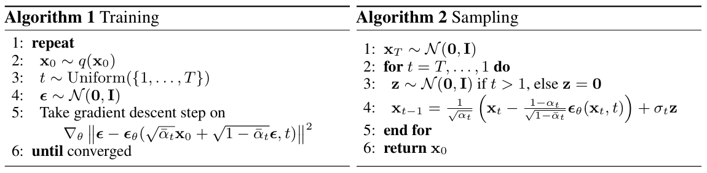

# Diffusion-Learning
This repository will record the practice code for learning Diffusion.

### Models

0. Noise-Predictor

1. DDPM

### References

[Denoising Diffusion Probabilistic Models](https://arxiv.org/abs/2006.11239)

[minDiffusion](https://github.com/cloneofsimo/minDiffusion)：这个教育资源库的目标是使用 PyTorch 提供一个独立的、极简的Diffusion实现。

